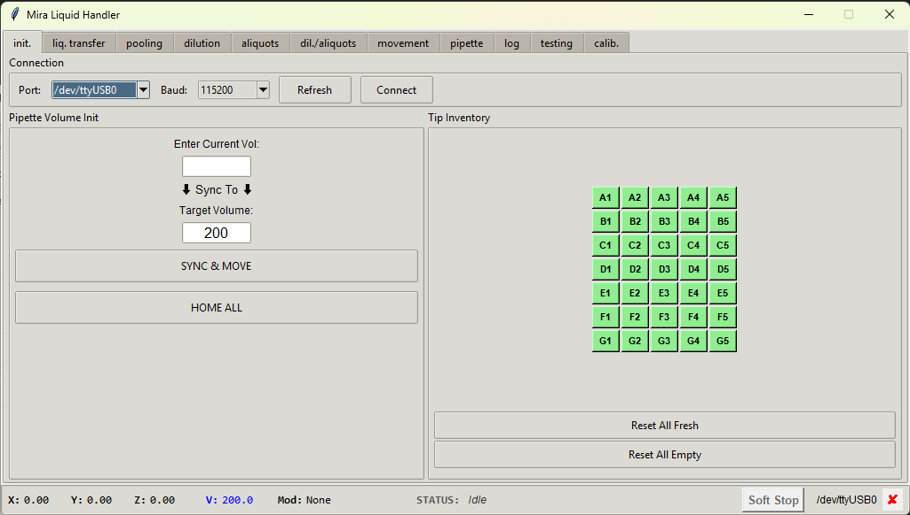
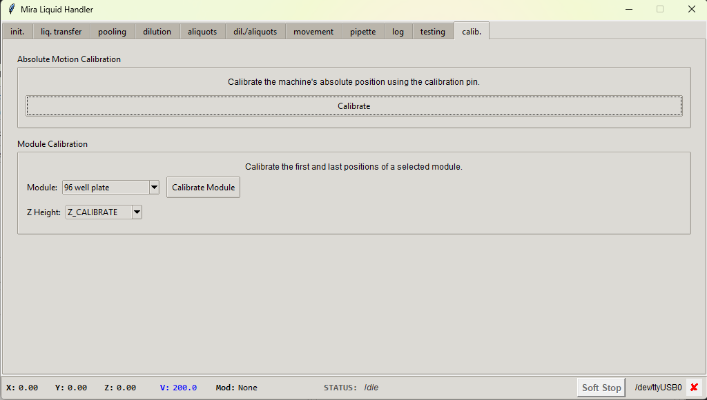

# DIY Liquid Handler

A DIY automated liquid handling system built from a Creality Ender 3 V3 SE 3D printer and Ependorf 1 mL pipette. 
Robot is controlled via a custom Python script that acts as a G-code graphical interface.

<table>
  <tr>
    <td width="52%" valign="top" align="center">
      
    </td>
    <td width="70%" valign="top" align="center">
      <br/>
      
    </td>
  </tr>
</table>

## Overview

This project transforms an inexpensive FDM 3D printer into a precision liquid handling robot capable of performing 
common laboratory workflows including liquid transfers, dilutions, pooling, and aliquoting. The system uses the 
printer's XYZ motion system for positioning and the extruder stepper motor to drive a pipette mechanism.

---

## What It Can Do

### Supported Protocols

| Protocol | Description |
|----------|-------------|
| **Liquid Transfer** | Move liquids between any modules (well-to-well, tube-to-plate, etc.) |
| **Pooling** | Combine multiple samples into a single destination |
| **Dilutions** | Create serial dilutions across 96-well plates |
| **Aliquoting** | Distribute samples from a source to multiple destinations |
| **Dilution + Aliquots** | Combined workflow for complex sample preparation |

### Supported Labware Modules

- **Vials** - Up to 3x96-well plates, 50 and 15 mL Falcon tubes, 4 mL vials, 1.5 mL HPLC vials, Eppendorf tubes, PCR vials
- **Wash Station** - 2-position cleaning/waste station
- **Tip Rack** - 7×5 grid (35 positions) for 1000 µL pipette tips
- **Tip Eject Station** - Tip disposal area

### Features

- **Pause & Resume** - Safely interrupt and continue long protocols
- **Soft Stop (Abort)** - Emergency stop without losing position
- **Live Position Tracking** - Real-time X/Y/Z coordinates and pipette volume display
- **Tip Inventory Management** - Visual grid showing available/used tips
- **Calibration Wizard** - Step-by-step module calibration with precision jog controls
- **Sequence Timer** - Estimated completion time with live countdown
- **Dry Run Mode** - Test protocols without physical execution
- **5 Preset Slots per Protocol** - Save and recall common configurations
- **Automatic Logging** - All actions logged to timestamped files

---

## What It Cannot Do

### Hardware Limitations

- **Single-channel only** - No multi-channel pipetting
- **Fixed pipette** - 10 µL to 1000 µL per transfer (configurable in code)
- **No liquid level detection** - Cannot auto-detect liquid heights in containers
- **No tip detection** - System trusts user-reported tip status; no physical confirmation
- **Fixed labware orientations** - Modules must be positioned at pre-calibrated locations

### Software Limitations

- **No plate reader integration** - Cannot read absorbance/fluorescence
- **No heated/cooled positions** - No temperature control for reactions
- **No barcode scanning** - Samples must be tracked manually
- **No cloud connectivity** - Local operation only

### Safety Limitations

- **No collision detection** - Will attempt to move to any valid coordinates
- **No spill detection** - Cannot detect or respond to liquid spills
- **No biosafety containment** - Not suitable for BSL-2+ without external containment

---

## Hardware Requirements

### Used Components

| Component                    | Specification                                              | Notes                                                        | Price               |
|------------------------------|------------------------------------------------------------|--------------------------------------------------------------|---------------------|
| Kinetic 4 axis system        | Creality Ender 3 V3 SE 3D printer                          | Refubrished, second hand market                              | 100 USD             |
| Controler                    | Raspberry Pi 5, 4 GB ram                                   | 40x40x5mm aluminium cooler                                   | 100 USD             |
| USB Keyboard, Mouse, Display | Hosyond 7 Inch IPS LCD Touch Screen Display Panel 1024×600 | Resolution hardcooded in the python script                   | 50 USD              |
| Analytical Pipette           | 100-1000 µL air displacement                               | 10 year old, freshly calibrated                              | 500 USD             |
| Pipette Tips                 | Universal 100-1000 µL tips                                 | Standard 82 mm length                                        | 50 USD/1000 pieces  |
| USB Cable                    | A to B or Micro-USB                                        | Make sure it supports serial com, some are only for charging | 10 USD              |
| Hardware                     | M3X8, M3X6 screws and nuts                                 | ca. 20 each                                                  | ca. 10 USD          |
| 3D printer to print parts    | Bambu P1S                                                  |                                                              | 600 USD             |
| Filament to print parts      | Elegoo PLA+ rapid, 1 kg                                    | STL, and STEP files on MakerWord (free)                      | filament ca. 10 USD |


---

## Software Requirements

### Dependencies

```bash
pip install pyserial
```

- Python 3.8 or higher
- tkinter (usually included with Python)
- pyserial 3.5+

### Supported Operating Systems

- Windows 10/11
- macOS 10.14+
- Linux (Ubuntu 20.04+ recommended)

---

## Installation & Setup

### 1. Printer Firmware Configuration

Ensure your printer is running Marlin firmware with these settings:

```gcode
M302 S0      ; Allow cold extrusion (required for pipette operation)
M906 E150    ; Pipette motor current (adjust as needed)
M84 E S3     ; Disable E stepper after 3s idle
```

### 2. Software Installation

```bash
# Clone or download this repository
git clone https://github.com/Dr-Mira/liquid-handler.git
cd liquid-handler

# Install dependencies
pip install -r requirements.txt
```

### 3. First Launch

```bash
python main.py
```

### 4. Initial Calibration

1. **Connect** to your printer via USB (115200 baud default)
2. **Home All** axes from the Init tab
3. **Absolute Calibration**: Use the Calib. tab with the calibration pin
4. **Module Calibration**: Calibrate each module's first and last corner positions
5. **Save Configuration**: Settings auto-save to `config.json`

---

## Configuration

All settings are stored in `config.json` and can be edited:

```json
{
  "CALIBRATION_PIN": {"PIN_X": 109.5, "PIN_Y": 111.4, "PIN_Z": 133.7},
  "PIPETTE": {"STEPS_PER_UL": 0.3019, "MIN_VOL": 100, "MAX_VOL": 1000},
  "TIP_RACK": {"A1_X": 69.4, "A1_Y": 31.4, ...},
  "PLATE": {"A1_X": -104.1, "A1_Y": 112.8, ...}
}
```

**⚠️ Backup your config.json after calibration!** Losing calibration means re-teaching all positions.

---

## Safety & Warnings

- **Never leave running unattended** - Always monitor operation
- **Keep emergency stop accessible** - Know your printer's reset button location
- **Verify clearances before homing** - Ensure no obstacles in XYZ path
- **Use appropriate PPE** - Gloves, goggles when handling hazardous liquids
- **Secure loose clothing/hair** - Can entangle in moving parts
- **Always home after power cycle** - Position is lost when power is removed
- **Check tip attachment** - Loose tips cause volume errors and spills
- **Mind the Z-height** - Wrong Z calibration crashes pipette into labware
- **Watch for bubbles** - Affects accuracy; pre-wet tips for better accuracy

---

## Project Structure

```
liquid-handler/
├── .log/             # Operation logs (auto-created)
├── .gitignore        # Excludes logs and config from git
├── stable/           # Version history (main_v1.py - main_v29.py)
├── main.py           # Main application (single file ~300KB)
├── config.json       # Calibration & settings (auto-generated)
└── README.md         # This file
```

---

## License

MIT License - Feel free to use, modify, and distribute. Attribution appreciated.

---

## Acknowledgments

- Built using the Marlin firmware project
- Inspired by the open-source lab automation community
- Thanks to the 3D printing community for hardware hacks

---

**⚠️ DISCLAIMER: This is experimental equipment. Use at your own risk. Always verify critical volumes independently. Not for clinical diagnostic use.**
